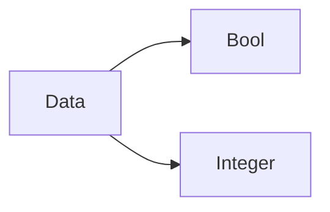
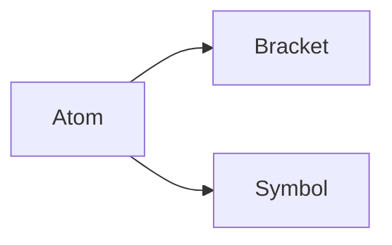
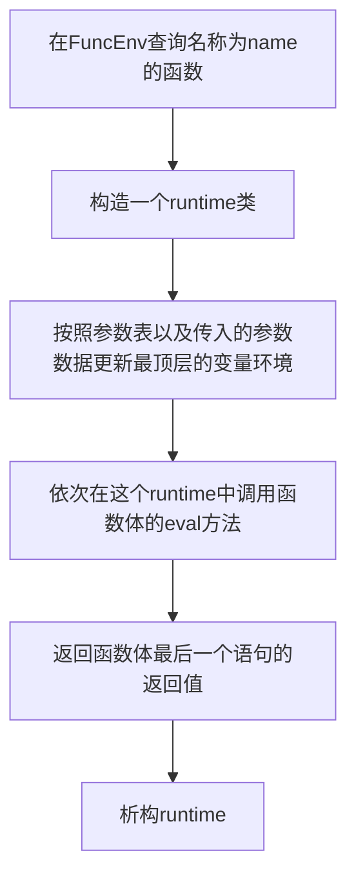

# 大作业设计说明书

大作业的程序名称为 `Final` ，是 `Final Is Not Another Lisp` 的递归缩写。

## 类设计

较长，因此独立出了单独的版本，网页版本请参考[这里](https://fugoes.github.io/Final)，PDF版本请参考当前目录下的 `类设计.pdf` 文件(建议使用网页版)。

## 算法设计

### 自动的内存管理

在本程序中，所有的数据都是一个 `Data` 类的实例， `Data` 是一个抽象类，派生出 `Bool` 类和 `Integer` 类，如图：

`Data` 类负责管理内存，派生类负责存储对应数据类型的信息以及实现对应数据类型的函数。其中，`Data` 类管理内存的方式是，`Data` 类有一个属性是 `cited` ，用于记录一个实例被多少个变量名引用了，当一个 `Data` 类实例的引用量为0时，程序就会将这个实例析构，从而达到自动内存管理的目的。 `~Data()` 是一个虚函数，析构的具体方式由派生类决定。

### 变量作用域的实现

在 `Final` 中，每一个括号都有一个变量作用域，在内层 `assign` 的变量在外层不可以使用，当出现同名的变量时，外层的变量会不可见，这是一个栈的结构，所以实现这样特性的方法是：

* 实现了一个 `VarEnv` 类，也就是一个变量环境，存储变量名及变量名指向的数据，提供变量查询、变量赋值函数；
* 实现了一个 `RunTime` 类，该类的一个属性是 `varEnvs` ，是一个 `std::list<VarEnv *>` ，在运行一段代码的时候，每深入一个括号，就在 `varEnvs` 中压入一个 `varEnv` ，作为当前所在的括号的变量环境，查询变量的时候，从栈顶向栈底逐层查询知道找到为止，给变量赋值的时候，在栈顶的 `varEnv` 中进行赋值，因此，内层的变量会覆盖外层的同名变量。每执行完一个括号的语句，就将栈顶的 `varEnv` 出栈并析构，因此外层是无法访问在内层中声明的变量的。

### 代码的解析与运行

在本程序中，所有的源代码会被解析成一个个 `Atom` 类实例，`Atom` 类是一个抽象类，派生出 `Bracket` 类和 `Symbol` 类：

`Bracket` 类表示一个括号的表达式，比如 `(+ 1 2)` 就会被解析成一个 `Bracket` 类实例，有两个属性：

* `func`

  用于存储函数名称，比如在这个例子中， `func` 就是 `"+"`

* `para`

  用来存储参数，是一个 `std::list<Atom*>` ，因此语句是可以嵌套多层括号的

而 `Symbol` 类表示一个符号，既可以是变量名也可以是常量。

通过嵌套的 `Atom` 类，将源代码解析成为了一个树状的结构。

`Atom` 类有一个 `eval(Runtime * runtime)` 方法，返回这个 `Atom` 的值，参数是用于获取变量值、进行赋值运算等，当 `Atom` 是一个 `Bracket` 时，`eval` 所做的事情是调用所有参数的 `eval` 方法后，执行函数名所代表的函数，并返回结果，而当 `Atom` 是一个 `Symbol` 时，`eval` 所做的事情是：如果这个符号是一个变量名，则在 `runtime` 中查找这个变量的值并返回；如果这个符号是一个常量，则返回这个常量所对应的值。 `eval` 是递归地执行的，因此可以遍历整个语法树得到表达式的运算结果。

### 函数调用的实现

`Function` 类代表一个用户自定义的函数，它记录了一个函数的参数表，以及有若干个 `Atom` 类对象组成的函数体，该类有一个静态属性： `FuncEnv	` ，记录用户自定义的函数的名称和它对应的 `Function` 类对象，函数的调用通过方法 `call(name, parameters)` 实现，调用函数的流程如图：

函数声明的语法可以参考用户手册，从上面的实现中可以看出，用户是可以自定义递归函数的，而且，每个函数的变量环境都是独立的，函数中除了通过传递参数外无法访问外部变量。

## 用户手册

参考[这里](https://github.com/Fugoes/Final)，PDF版本请参考当前目录下的`用户手册.pdf`文件。

## 程序源代码

参考[这里](https://github.com/Fugoes/Final/tree/master/src)，也可以参考`src`目录下的内容。编译方法请参考用户手册。

## 测试用例

参考[这里](https://github.com/Fugoes/Final/tree/master/test)，也可以参考`test`目录下的内容，具体测试方法是(Linux系统)：编译本软件，将得到的可执行文件移动到`test`目录下，运行`test.sh`，即可以完成所有的测试，如果想单独测试某一个用例，可以使用`./Final xx.final`命令来实现。